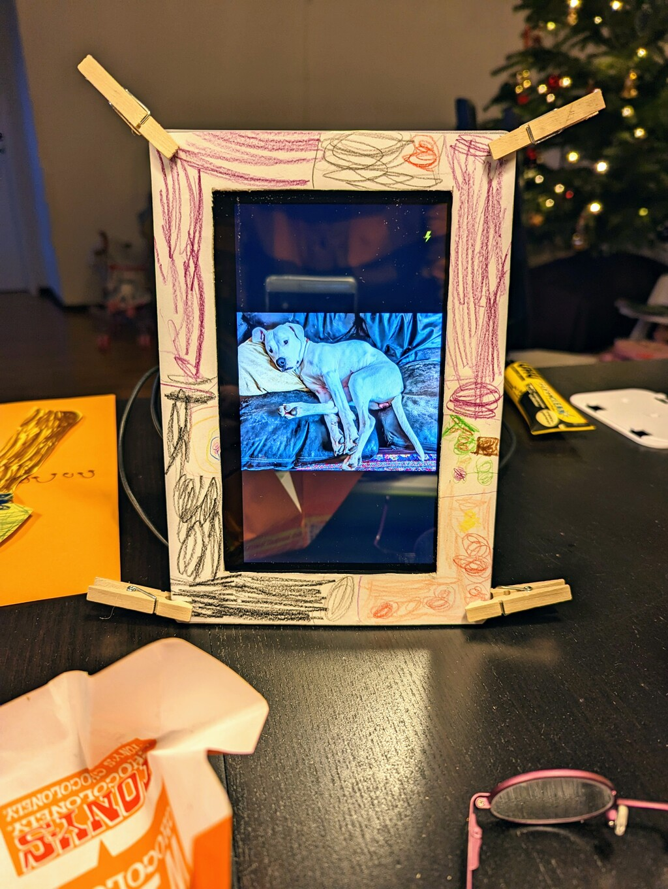

# monisrahmen

A digital picture frame you can send emails to.



## Description

Send pictures as email attachments.
They will be downloaded and displayed in a loop.  

The mounting frame is 3D printed.  
Some light soldering is required.

## Features

* Send one or more pictures as email attachments.
* Add more pictures by putting them on a network share.
* Duplicate files will be ignored.
* Screen blanking is controlled by a motion sensor.
* A splash screen is showing device information.
* Most options are configurable.

### Bill of materials

* 1 Raspberry Pi 2  
  The Raspberry 2 is sufficient for this project and can be found for relatively cheap in late 2022.
* 1 USB WLAN adapter like Edimax or TP-Link brand
* 1 WaveShare model 7" IPS/QLED Integrated Display, 1024x600, 70H-1024600
* 1 RCWL-0516 doppler radar microwave motion sensor module
* 1 HDMI cable of 30 cm length
* 8 M2.5 screws, nuts and standoffs  
  Plastic is fine.
* 1 USB-A to Micro USB-B cable
* 1 USB-A to USB-C cable
* 1 USB wall charger  
  The power draw of the display is about 350 mA.
* 6 square head female-to-female DuPont cables
* 1 4x1 male pin-headers
* Small cable ties

### Tools

* Soldering equipment
* Hot glue gun

### 3D printing

The STL files are located in ``site_documents/designs/``.  
They have been printed in PETG with 15 % infill and supports, but PLA will also work.

### Hardware setup

* See [ASSEMBLY](site_documents/ASSEMBLY.md).

### Installing

* Install Pi OS Lite 32-bit using the Raspberry Pi Imager.  
  You can set up the host name, user account, SSH and Wifi in the options of the Imager.
  You should then be able to ssh into your Raspberry.

* Install dependencies:
    ```
    sudo apt-get install fbi fonts-dejavu-core git python3 python3-pip python3-venv samba
    ```

    If using DietPi instead of Pi OS add also:
    ```
    sudo apt-get install libopenjp2-7 libxcb1
    ```

* Download the software:
    ```
    git clone https://github.com/sabotrax/monisrahmen.git
    ```

* Create the virtual environment for Python and install the required modules:
    ```
    cd monisrahmen
    python3 -m venv .
    source bin/activate
    pip3 install -r requirements.txt
    echo "source ~/monisrahmen/bin/activate" >> ~/.bashrc
    ```

* Create ``.env`` as the configuration file:
    ```
    # installation directory
    PROJECT_PATH=/home/schommer/monisrahmen
    # email settings
    EMAIL_USER=IMAP_USER
    EMAIL_PASS=IMAP_PASSWORD
    EMAIL_HOST=IMAP_HOST
    EMAIL_PORT=993
    EMAIL_INBOX=Inbox
    # email subject for image processing
    EMAIL_KEYWORD=foto
    # delete emails after retrieval
    DELETE_EMAIL=False
    # unkown sender
    UNKNOWN_SENDER=Unknown
    # motion sensor timeout for screen blanking (seconds)
    DISPLAY_TIMEOUT=120
    # leave empty if not using
    START_MONITORING=
    END_MONITORING=
    # network device
    NETWORK_DEVICE=wlan0
    # network error message
    NETWORK_ERROR="Network error!"
    # splash image font
    FONT_SIZE=30
    # screen resolution
    SCREEN_WIDTH=1024
    SCREEN_HEIGHT=600
    # be verbose
    DEBUG=False
    ```

* Configure the display in ``/boot/config.txt``.  
    For the WaveShare model 7" IPS/QLED 1024x600 70H-1024600:
    ```
    hdmi_group=2
    hdmi_mode=87
    hdmi_cvt=1024 600 60 6 0 0 0
    hdmi_drive=1
    ```

    Display blanking:
    ```
    #dtoverlay=vc4-kms-v3d
    hdmi_blanking=1
    ```
    Blanking an HDMI display would work only on the Pi 2 if we used the legacy graphics driver.

    Rotate the virtual console:
    ```
    display_hdmi_rotate=3
    ```
    This would also only work with the legacy driver.

* Suppress boot messages.  
    Append to the end of the line of ``/boot/cmdline.txt``:
    ```
    consoleblank=1 logo.nologo vt.global_cursor_default=0
    ```

    Add to ``/boot/config.txt``:
    ```
    avoid_warnings=1
    disable_splash=1
    ```

* Configure the Samba share.  
    Add to the end of ``/etc/samba/smb.conf``:
    ```
    [bilder]
    # change accordingly to your installation directory
    path = /home/schommer/monisrahmen/pictures/
    public = yes
    writable = yes
    comment = Bilder
    printable = no
    guest ok = yes
    ```

    Change directory rights so image files can be managed from your file manager:
    ```
    chmod 777 pictures
    ```

* Edit the shell scripts.  
    Change the installation directories in ``sitebin/restart_fbi.sh`` and ``sitebin/startup.sh``.  
    The image reload interval can also be configured in ``sitebin/restart_fbi.sh``.

* Set up Cron.  
    For your user ``crontab -e``
    ```
    INST_DIR=/home/schommer/monisrahmen
    VENV_PYTHON=/home/schommer/monisrahmen/bin/python3
    @reboot                $VENV_PYTHON $INST_DIR/blank_screen.py
    0,15,30,45 * * * *     $VENV_PYTHON $INST_DIR/get_pics_by_mail.py
    @hourly                $VENV_PYTHON $INST_DIR/sync_database.py
    ```

    For root ``sudo crontab -e``
    ```
    INST_DIR=/home/schommer/monisrahmen
    @reboot                $INST_DIR/sitebin/startup.sh > /dev/null 2>&1
    2,17,32,47 * * * *     $INST_DIR/sitebin/restart_fbi.sh > /dev/null 2>&1
    ```

    Adjust INST_DIR according to your installation directory.  
    Notice that fbi is being restarted shortly after emails have been checked.

## License

Distributed under the New BSD License, see LICENSE.txt.

## Acknowledgments

Inspiration, documentation, code snippets, etc.
* [Building a living photo frame](https://www.ofbrooklyn.com/2014/01/2/building-photo-frame-raspberry-pi-motion-detector/)
* Waveshare display [Wiki](https://www.waveshare.com/wiki/70H-1024600) 
* [RCWL-0516](https://wolles-elektronikkiste.de/en/rcwl-0516-microwave-radar-motion-detector) microwave radar motion detector
* Raspberry Pi [config.txt](https://www.raspberrypi.com/documentation/computers/config_txt.html) documentation
* Crontab configuration ``man 5 crontab``
* Samba configuration ``man 5 smb.conf``
* fbi - Linux framebuffer image viewer ``man fbi``
